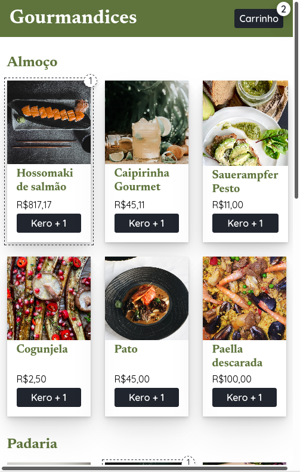

## Exercício de classe 🏫

### Migrando o estado global para a API de contexto

Você trabalha para a empresa Gourmandices e fez o e-commerce dela, mas está tendo problemas: você tem muito ***prop drilling***. Usando como base a pasta `base-do-gourmandices`, migre apenas o estado global para usar a API de contexto, de forma a **eliminar o *prop drilling***. Lembre-se de copiar e colar a pasta de base na pasta deste exercício, já que outros exercícios vão usar a mesma base.

---

Preencha a checklist para finalizar o exercício:

- [ ] Resolver o exercício
- [ ] Adicionar as mudanças aos commits (`git add .` para adicionar todos os arquivos ou `git add nome_do_arquivo` para adicionar um arquivo específico)
- [ ] Commitar a cada mudança significativa ou na finalização do exercício (`git commit -m "Mensagem do commit"`)
- [ ] Pushar os commits na sua branch na origem (`git push origin nome-da-branch`)
- [ ] Realizar o pull request

###### tags: `prop drilling`, `estado global`, `API de contexto`
