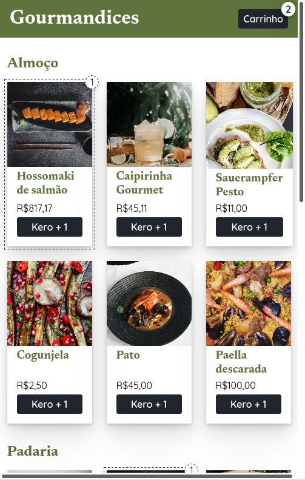

## Exercício de classe 🏫

### Refatorando Gourmandices, parte 2: com contexto

Você trabalha para a empresa Gourmandices e fez o e-commerce dela, mas está tendo problemas. A função `incrementarCarrinho`, no componente `<App />`, tem várias responsabilidades: adicionar um produto ao carrinho, mudar a quantidade de itens no carrinho e remover um produto do carrinho. Essa múltipla responsabilidade está te incomodando e, por isso, você deve separar essa função em 3:

- `adicionarAoCarrinho`, que recebe apenas o id do produto;
- `mudarQtdNoCarrinho`, que recebe o id do produto e a nova quantidade, que deve ser maior que 0;
- `removerDoCarrinho`, que recebe apenas o id do produto.

Isso deve ser feito **usando a API de contexto** e com base na sua solução do exercício `classe-01`.

---

Preencha a checklist para finalizar o exercício:

- [ ] Resolver o exercício
- [ ] Adicionar as mudanças aos commits (`git add .` para adicionar todos os arquivos ou `git add nome_do_arquivo` para adicionar um arquivo específico)
- [ ] Commitar a cada mudança significativa ou na finalização do exercício (`git commit -m "Mensagem do commit"`)
- [ ] Pushar os commits na sua branch na origem (`git push origin nome-da-branch`)
- [ ] Realizar o pull request

###### tags: `prop drilling`, `estado global`, `API de contexto`
